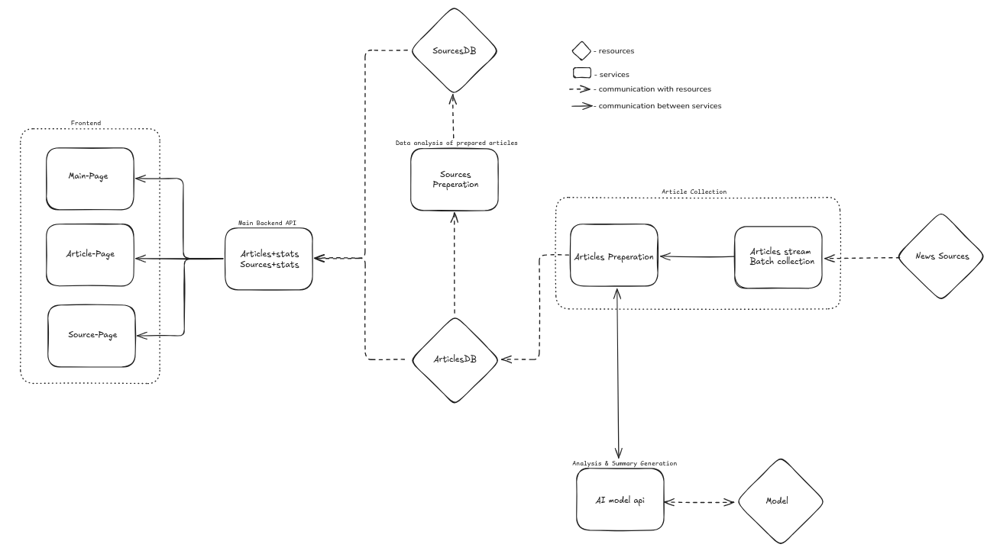

# Glancefy Backend API

This Django-based API serves as the backend for Glancefy, an AI-driven automated news aggregation platform.

## Project initial architecture diagram

## Setup

1. Clone the repository:
   git clone https://github.com/your-repo/glancefy-backend.git

   `cd glancefy-backend`

2. Set up a virtual environment:

   `python -m venv glancefy_env`

   `source glancefy_env/bin/activate`

   On Windows:

   `glancefy_env\Scripts\activate`

3. Install dependencies:

   `pip install -r requirements.txt`

4. Prep db for migrations:

   `python manage.py makemigrations` (if needed)

5. Apply migrations:

   `python manage.py migrate`

6. Create admin user:

   `python manage.py createsuperuser`

7. Run the development server:

   `python manage.py runserver`

## Testing

Run tests using pytest:
`pytest`

## API Endpoints

- `/api/articles/`: Manage news articles
- `/api/sources/`: Manage news sources
- `/api/stats/`: Retrieve article and source statistics

For full API documentation, visit `/api/docs/` when the server is running.

## Tech Stack

- Python 3.11.9
- Django 5.1
- Django REST Framework 3.15.2
- PostgreSQL 14+
- celery 5.2.3
- redis 4.5.4
- Docker & Docker Compose

## Contributing

Please read CONTRIBUTING.md for details on our code of conduct and the process for submitting pull requests.

## License

This project is licensed under the MIT License - see the LICENSE file for details.
This README provides a quick overview of the project, setup instructions, testing information, main API endpoints, tech stack, and links to contribution guidelines and licensing information. You can expand on this as needed, adding sections for deployment, configuration, or more detailed usage instructions as the project evolves.
